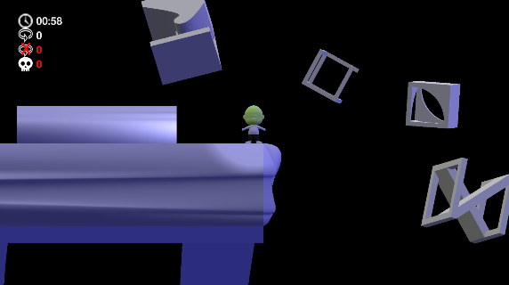

## The story

Milton’s parents have sent him to spend the summer with his great uncle, M. C. Escher. Uncle Escher is a stranger to Milton, and his mansion is dark, drafty, and bizarre. Milton gets lost in the house almost every day. It feels like the house is always changing.

Uncle Escher is plagued by fever dreams of cubes and shapes that are driving him mad. He tells Milton to ignore any sounds that wake him in the night, and to stay in his bed until morning. Milton thinks Uncle Escher must be too embarrassed to admit he cries out in his sleep.

One night, Milton awakes to sinister whooshing sounds, like the yawn of a monster, coming from below his bed. These sounds are certainly not coming from Uncle Escher, so Milton climbs out of bed. When he crouches down to take a look, he cannot see any monsters––but even worse, a dark hole appears, and pulls him into the void below!

## The game

## How to play

- Download the game version that suits your operating system (Windows 10 or Linux)
- Unzip the the corresponding file: [eschers-dream-windows.zip](https://drive.google.com/file/d/1IAm8gN4tmAo0Fv3chPJb3MK-XCG6usch/view?usp=sharing) or [eschers-dream-linux.zip](https://drive.google.com/file/d/1ViPaHFCuc4yB4rtethfWn77vD3WZWOp6/view?usp=sharing)
- Double click on the file: Escher's Dream.exe for Windows 10, or Escher's Dream.x86_64 for Linux

### Controls

- Press A/D or the arrow keys to move left or right
- Press Q/E to rotate the world
- Press R to reset the level
- Reach th end of the tower to win
- Press Esc to return to the main title

### Credits

A game by: [David Garzón Ramos](https://twitter.com/dgarzonramos), Mary Katherine Heinrich, Miquel Kegeleirs, and Jonas Kuckling